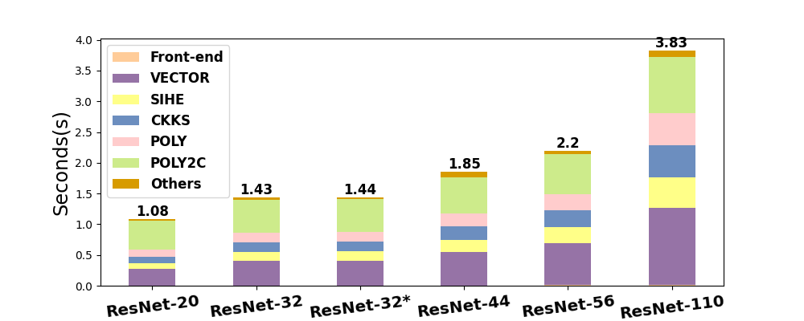
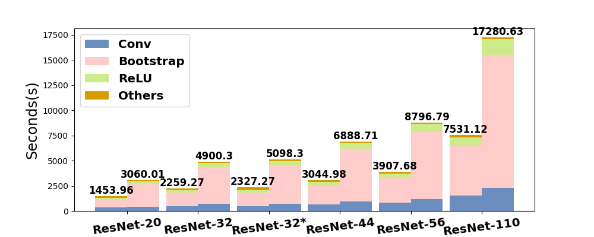
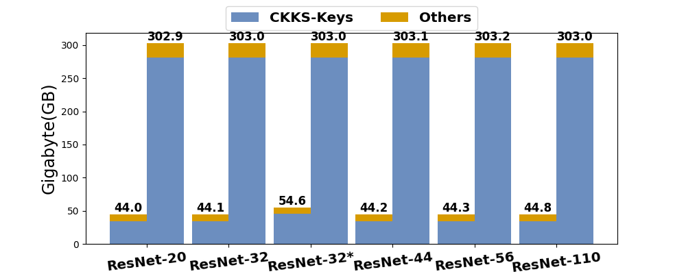
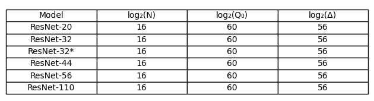
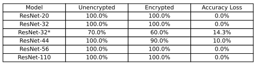
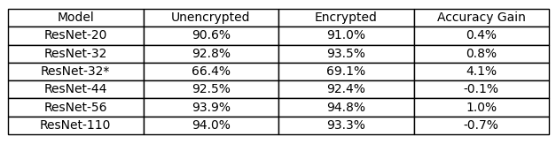

README
================

We provide instructions to enable the evaluation of the artifact associated with our CGO'25 Tool Paper, titled "ACE: An FHE Compiler Framework for Automating Neural Network Inference." This paper presents ACE, an open-source FHE compiler that converts ONNX models into equivalent FHE models to perform encrypted inference(https://ace-compiler.github.io/).

Let us rephrase slightly a paragraph from our author response for this CGO'25 tool paper: ACE is the first FHE compiler to automatically compile ONNX models to C/C++ using the CKKS scheme for CPUs. It has been evaluated using a series of six ResNet models, including ResNet110, the most complex model employed in FHE compiler research. Developed as an open-source tool through 44 man-months of collaborative engineering by several experts, ACE is poised to significantly benefit the compiler community in this critical area.

In our evaluation, we compared the ACE compiler with expert hand-tuned implementations using six ResNet models: ResNet-[20|32|44|56|110] on CIFAR-10 and ResNet-32 on CIFAR-100 (referred to as ResNet-32*). The objective of this artifact evaluation is to reproduce our results, presented in Figures 5-7 and Tables 9-10:
- **Figure 5**: Compile times achieved by ACE
- **Figure 6**: Comparison of encrypted inference times between ACE and expert implementations
- **Figure 7**: Comparison of memory usage between ACE and expert implementations
- **Table 9**: Security parameters selected for the CKKS scheme by ACE
- **Table 10**: Comparison of accuracy between encrypted inference via the ACE Compiler and unencrypted inference

*Let us begin by noting that performing artifact evaluation for FHE compilation, especially for encrypted inference, is challenging due to the substantial computing resources and significant running times required.*

It is essential to emphasize that FHE remains up to 10,000 times slower than unencrypted computation, even for small machine learning models. To achieve the results presented in Table 10, we tested 1,000 images for each of the six ResNet models. Performing these tests would require approximately 5,000 hours (over 208 days) if conducted sequentially using a single thread on one CPU core. To manage this extensive computational demand efficiently, we conducted encrypted inference tests in parallel using multi-core systems.

To generate Figures 5-7 and Table 9, the process will take **approximately 18 hours**.
However, reproducing Table 10 presents a significant challenge due to the computational intensity required for artifact evaluation. To facilitate this, we have provided a script that generates the table using only 10 images per model. On a computing platform equipped with 10 cores (details provided below), completing this process is expected to take **approximately 7 hours**. Please note, however, that the results obtained with this abbreviated method should be considered approximate. For those who wish to conduct tests using 1,000 images per model, please be aware that this extended evaluation will take **over 140 hours** on a 64-core platform.

*It is important to note that, like existing FHE compilers, the ACE compiler achieves accuracy in encrypted inference comparable to that of unencrypted inference. Table 10 is included for completeness and does not represent a contribution in this paper. Table 9 simply lists the security parameters used by the ACE compiler. The major results of this paper are presented in Figures 5-7: Figure 5 presents the compile times for the six ResNet models. Figures 6 and 7 compare the ACE compiler to expert hand-tuned implementations, focusing on per-image encrypted inference time and memory usage for each model, respectively.*

*Additionally, the ACE compiler compiles all six ResNet models within seconds. As a result, the Figure 5 you obtain may slightly differ from Figure 5 in our paper. Similarly, your Figure 6 and our Figure 6 may show minor variations. However, the overall trends in both Figures 5 and 6 will remain consistent.*


To facilitate artifact evaluation, we provide detailed steps, environment setup, and execution guidelines to ensure that the findings of our research can be independently verified.


**Hardware Setup:**  
- Intel Xeon Platinum 8369B CPU @ 2.70 GHz  
- 512 GB memory  

**Software Requirements:**  
- Detailed in the [*Dockerfile*](https://github.com/ace-compiler/ace-compiler/blob/main/Dockerfile) for Docker container version 25.0.1
- Docker image based on Ubuntu 20.04

Encrypted inference is both compute-intensive and memory-intensive. A computer with at least **400GB** of memory is required to perform artifact evaluation for our work.


## Repository Overview
- **air-infra:** Contains the base components of the ACE compiler.
- **fhe-cmplr:** Houses FHE-related components of the ACE compiler.
- **FHE-MP-CNN:** Directory with EXPERT-implemented source code.
- **model:** Stores pre-trained ONNX models.
- **nn-addon:** Includes ONNX-related components for the ACE compiler.
- **scripts:** Scripts for building and running ACE and EXPERT tests.
- **README.md:** This README file.
- **Dockerfile:** File used to build the Docker image.
- **requirements.txt:** Specifies Python package requirements.

### 1. Preparing a DOCKER environment to Build and Test the ACE Compiler

It is recommended to pull the pre-built docker image (opencc/ace:latest) from Docker Hub:
```
cd [YOUR_DIR_TO_DO_AE]
mkdir -p ace_ae_result
docker pull opencc/ace:latest
docker run -it --name ace -v "$(pwd)"/ace_ae_result:/app/ace_ae_result --privileged opencc/ace:latest bash
```
A local directory `ace_ae_result` is created and mounted in the docker container to collect the generated figures and tables. The container will launch and automatically enters the `/app` directory:
```
root@xxxxxx:/app#
```
Alternatively, if you encounter issues pulling the pre-built image, you can build the image from the [*Dockerfile*](https://github.com/ace-compiler/ace-compiler/blob/main/Dockerfile):
```
cd [YOUR_DIR_TO_DO_AE]
git clone https://github.com/ace-compiler/ace-compiler.git
cd ace-compiler
mkdir -p ace_ae_result
docker build -t ace:latest .
docker run -it --name ace -v "$(pwd)"/ace_ae_result:/app/ace_ae_result --privileged ace:latest bash
```

### 2. Building the ACE Compiler

To build the ACE compiler, navigate to the `/app` directory within the container and run:
```
/app/scripts/build_cmplr.sh Release
```
Upon successful completion, you will see:
```
Info: build project succeeded. FHE compiler executable can be found in /app/ace_cmplr/bin/fhe_cmplr
root@xxxxxx:/app#
```
The ACE compiler will be built under `/app/release` and installed in the `/app/ace_cmplr` directory.

### 3. Reproducing Figures 5-7 and Table 9

For a given machine learning model, an ACE test refers to a test conducted using the FHE equivalent version of the model, generated by the ACE compiler, to perform encrypted inference. An EXPERT test refers to a test conducted using the expert hand-tuned FHE implementation from the paper [*Low-Complexity Deep Convolutional Neural Networks on Fully Homomorphic Encryption Using Multiplexed Parallel Convolutions*](https://eprint.iacr.org/2021/1688). Both ACE and EXPERT tests are performed for ResNet-[20|32|44|56|110] on CIFAR-10 and ResNet-32 on CIFAR-100 (referred to as ResNet-32*).

All pre-trained ONNX models utilized by the ACE compiler are located in the [*model*](https://github.com/ace-compiler/ace-compiler/tree/main/model) directory.

*Note: For the hardware environment outlined above, it will take **approximately 5 hours** to complete all the ACE tests and **around 13 hours** to complete all the EXPERT tests (using a single thread).*

#### 3.1 Building EXPERT Hand-Tuned Implementations

In the `/app` directory of the container, run:
```
python3 /app/FHE-MP-CNN/build_cnn.py
```
This will pull code from the EXPERT repository and build the executables. During the build process, it will download external packages needed to build the SEAL library. Upon successful execution of the command, the following message will appear in the prompt:
```
[100%] Built target cnn
root@xxxxxx:/app#
```
The EXPERT source code will be pulled to `/app/FHE-MP-CNN/FHE-MP-CNN`, and the executables will be built in the `/app/FHE-MP-CNN/FHE-MP-CNN/cnn_ckks/build_cnn` directory.


#### 3.2 Running All ACE and EXPERT Tests 

In the `/app` directory of the container, run:
```
python3 /app/scripts/perf.py -a
```
Performance data will be printed, and upon completion, you will see:
```
-------- Done --------
root@xxxxxx:/app#
```
A log file named with the date and time the command was launched will be generated, such as `2024_05_26_13_18.log`. You can refer to this log for performance data or failure information. For example, if you encounter a **"failed due to SIGKILL"** message, it is likely that you have run out of memory for an EXPERT case. If the process completes successfully, proceed by running:
```
python3 /app/scripts/generate_figures.py -f 2024_05_26_13_18.log
```
The script will generate the results as depicted in the figures and tables of our paper. The outputs are named 'Figure5.pdf', 'Figure6.pdf', 'Figure7.pdf', and 'Table9.pdf'. For the raw data, please refer to the corresponding *.log files.

Here is what you can expect from each file:

- **Figure5.pdf**:
  
- **Figure6.pdf**:
  
- **Figure7.pdf**:
  
- **Table9.pdf**:
  

*Note: Figures 5-7 and Table 9 shown above use the same data as presented in our paper. However, the appearance of the generated PDF files might vary slightly due to differences in the hardware environments used.*

### 4. Reproducing Table 10

Table 10 compares the accuracy of encrypted inference for each ResNet model used against the accuracy of unencrypted inference using the same model.

For the data presented in Table 10 of our paper, we tested 1,000 images per model for both encrypted and unencrypted inference. The total time to perform unencrypted inference across all six models is only about one minute when using a single thread. In contrast, encrypted inference would require over 5,000 hours (more than 208 days) using a single thread.

Due to the extensive time required for encrypted inference, parallel execution is necessary. Thus, you are encouraged to conduct this part of the evaluation on a multi-core platform, utilizing as many cores as available to optimize efficiency.


#### 4.1 Building the ACE Compiler with OpenMP support

In the `/app` directory of the container, run:
```
/app/scripts/build_cmplr_omp.sh Release
```
Upon successful completion, you will see the following message in the prompt:
```
Info: build project succeeded. FHE compiler executable can be found in release_openmp/driver/fhe_cmplr
root@xxxxxx:/app# 
```
Then, the OpenMP version of the ACE compiler will be built under `/app/release_openmp` and installed in the directory `/app/release_openmp/driver`.

#### 4.2 Performing both Unencrypted and Encrypted Inference Tests

In the `/app` directory of the container, run:
```
python3 /app/scripts/accuracy_all.py -n 10
```
This process will concurrently conduct encrypted inference tests on the first 10 images (indexed from 0 to 9) for each of the six ResNet models considered in the paper, leveraging all available CPU cores on the system. Similarly, unencrypted inference tests will be performed in parallel. With 10 cores assumed to be available, the expected completion time is **approximately 7 hours**. Upon completion, you will observe the following:
```
Table10-n-ImagesOnly.pdf generated!
root@xxxxxx:/app#
```

We have generated a version of Table 10 by testing only 10 images per model, as shown below:


Your version of Table 10 should closely resemble ours. Although these results differ from those reported in Table 10 of the paper, they already demonstrate that the accuracy achieved by encrypted inference under the ACE compiler is comparable to that achieved by unencrypted inference.

To run both unencrypted and encrypted inference tests for the first 1000 images per model, execute the following command in the `/app` directory of the container:
```
python3 /app/scripts/accuracy_all.py -n 1000
```
This process will take **over 140 hours** to complete on the recommended computing platform, utilizing 64 threads.

The resulting output, `Table10.pdf`, will appear as follows:


*Note: The table displayed above is taken directly from our paper. The table you reproduce may look slightly different due to variations in the execution environments used.*
