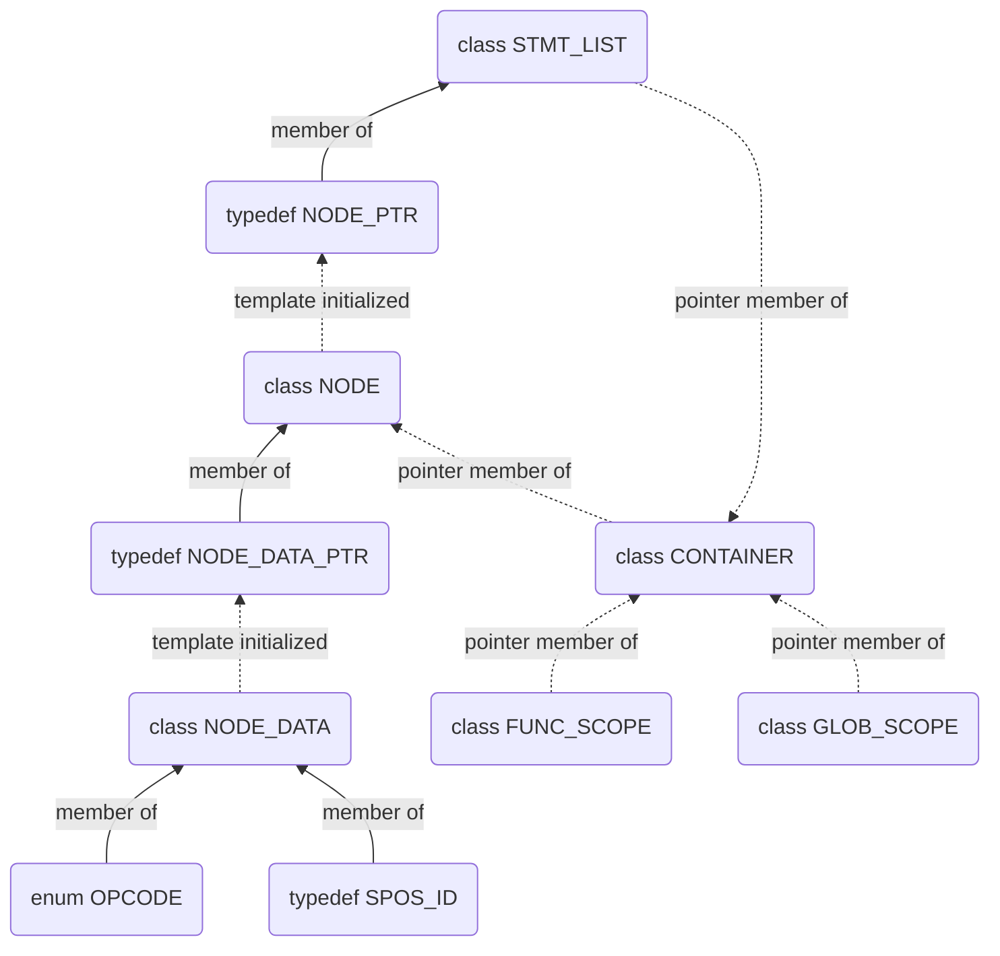
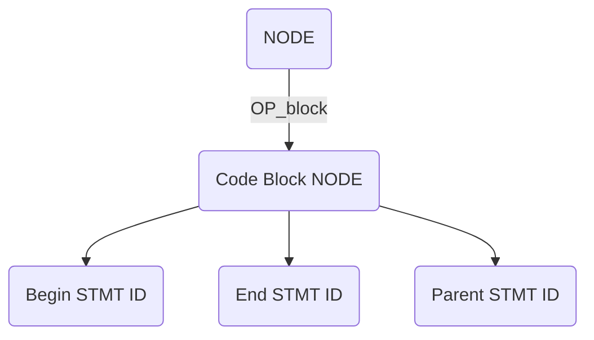

# AIR Code Design and Implementation



## Container
An AIR container holds codes in AIR form as its data, provides manipulation APIs 
like new, delete, get etc., can be an input (and output if not changed 
in place) of lowering or optimzation.

A container class has a statement list for codes of a function, 
a function scope for the (local) symbol table of the function
and a global scope for the global symbol table.

```
class CONTAINER {
public:
  FUNC_SCOPE* Func_scope(void) const { return _func; }
  GLOB_SCOPE* Glob_scope(void) const { return _glob; }
  STMT_LIST*  Stmt_list(void) const { return _stmt_list; }
  STMT_PTR    Begin_stmt(void) const;
  STMT_PTR    End_stmt(void) const;
  NODE_PTR    Node(NODE_ID node) const;
  STMT_PTR    Stmt(STMT_ID stmt) const;

  NODE_PTR New_void(CONST_SPOS_PTR spos);
  NODE_PTR New_stmt_block(CONST_SPOS_PTR spos);
  STMT_PTR New_if_then_else(CONST_NODE_PTR cond, NODE_PTR then_b,
                            NODE_PTR else_b, CONST_SPOS_PTR spos);
  STMT_PTR New_do_loop(NODE_PTR comp, NODE_PTR incr, NODE_PTR body,
                       CONST_SPOS_PTR spos);
  ...

  NODE_PTR New_cust_node(air::core::OPCODE op, uint32_t num_opnd,
                         CONST_SPOS_PTR spos);
  void     New_cust_opnd(NODE_PTR cust, uint32_t num, CONST_NODE_PTR arg);
  STMT_PTR New_cust_stmt(air::core::OPCODE op, CONST_TMP_VAR_PTR retv,
                         uint32_t num_opnd, CONST_SPOS_PTR spos);
  void     New_cust_arg(STMT_PTR cust, uint32_t num, CONST_NODE_PTR arg);
  bool     Verify_cust_stmt(CONST_STMT_PTR cust);

  void Print(FILE* f = stdout);

private:
  FUNC_SCOPE* _func;
  GLOB_SCOPE* _glob;
  STMT_LIST*  _stmt_list;
};
```

## Statement List
A statement list holds code statements in AIR form stored in a NODE_PTR and APIs manipulating statements like get, set, insert etc.

```
class STMT_LIST {
public:
  STMT_LIST(NODE_PTR code);

  CONTAINER* Container(void) const;
  NODE_PTR   Node(void) const { return _node; }

  STMT_PTR Begin_stmt(void) const;
  STMT_ID  Begin_stmt_id(void) const;
  STMT_PTR End_stmt(void) const;
  STMT_ID  End_stmt_id(void) const;

  void Begin_stmt(STMT_PTR stmt);
  void Begin_stmt(STMT_ID stmt);
  void End_stmt(STMT_PTR stmt);
  void End_stmt(STMT_ID stmt);

  bool Is_empty(void) const;

  STMT_PTR Insert(STMT_PTR pos, STMT_PTR stmt);
  STMT_PTR Remove(STMT_PTR pos);
  STMT_PTR Append(STMT_PTR stmt);
  STMT_PTR Erase(STMT_PTR pos);

  void Print(FILE* f = stdout);

private:
  NODE_PTR _node;
};
```

A statement list starts with a code block NODE.



## Node
An AIR node represents an AIR operation like call, sub, add etc. 
It is accessed via a smart pointer NODE_PTR that points to NODE,
where raw data (via NODE_DATA_PTR) and the container that it resides are stored.

NODE_DATA_PTR is a smart pointer to NODE_DATA that stores information of
its operation like opcode, operands, source position and result type.

```
typedef PTR<NODE>          NODE_PTR;

class NODE {
public:
  NODE_ID     Id(void) const;
  CONTAINER*  Container(void) const;
  FUNC_SCOPE* Func_scope(void);
  GLOB_SCOPE* Glob_scope(void);
  const char* Name(void) const;
  ...
  void Print(FILE* f = stdout);

private:
  CONTAINER*    _cont;
  NODE_DATA_PTR _data;
};

typedef PTR_FROM_DATA<NODE_DATA> NODE_DATA_PTR;

class NODE_DATA {
public:
  friend class NODE;
  friend class STMT;
  friend class STMT_DATA;
  friend class CONTAINTER;

private:
  NODE_DATA();
  NODE_DATA(air::core::OPCODE opc, SPOS_ID sid, TYPE_ID tid);
  ...

  struct COMM {
    union {
      struct {
        uint32_t _opcode : 8;
        uint32_t _padding : 24;
      } _opcode;
      ...
    }
    SPOS_ID _spos;
  } _comm;
};
```

## Node ID and Statement ID
The IDs of NODE and STMT are built to be strongly typed from uint32_t.

```
template <typename T>
class ID {
public:
  explicit ID(uint32_t id = Null_prim_id) : _id(id) {}
  uint32_t Value(void) const { return _id; }

  bool operator==(ID<T> o) const { return _id == o._id; }
  bool operator!=(ID<T> o) const { return !(*this == o); }
  bool operator<(ID<T> o) const { return _id < o._id; }
  bool operator!() const { return _id == Null_prim_id; }

  template <typename F>
  ID(ID<F> id);

  typedef T DOMAIN_TYPE;

private:
  template <typename F>
  T* Check_iconv();

  uint32_t _id;
};

typedef ID<NODE_DATA> NODE_ID;
typedef ID<STMT_DATA> STMT_ID;
```

## Statement
AIR statement data structure, besides NODE data, it holds links to its previous and next statements. Similar to AIR node, a statement is accessed via STMTPTR. A NODE can represent an expression or a statement, and statements in AIR are: control flow, call, store, label, region and pragma.

```
typedef PTR<STMT>          STMT_PTR;

class STMT {
public:
  STMT_ID     Id() const;
  CONTAINER*  Container() const;
  FUNC_SCOPE* Func_scope() const;
  GLOB_SCOPE* Glob_scope() const;
  ...

  void Print(FILE* f = stdout);

private:
  CONTAINER*    _cont;
  STMT_DATA_PTR _data;
};

typedef PTR_FROM_DATA<STMT_DATA> STMT_DATA_PTR;

class STMT_DATA {
public:
  friend class NODE;
  friend class STMT;
  friend class CONTAINER;

private:
  STMT_DATA() : _prev(Null_id), _next(Null_id), _data() {}
  STMT_DATA(air::core::OPCODE opc, SPOS_ID sid)
      : _prev(Null_id), _next(Null_id), _data(opc, sid, TYPE_ID()) {}

  STMT_DATA(const STMT_DATA& node)
      : _prev(node._prev), _next(node._next), _data(node._data) {}
  STMT_ID   _prev;
  STMT_ID   _next;
  NODE_DATA _data;
};
```

## Symbol Table ID
Similar to node id, but used for symbol table related data. Take TYPE as an example:

```
typedef ID_BASE<TYPE> TYPE_ID;

template <typename T>
class ID_BASE {
public:
  explicit ID_BASE(uint32_t id = NULL_ST_ID) : _id(id) {}
  ID_BASE(uint32_t idx, uint32_t scope) { _id = (scope << ID_WIDTH) + idx; }
  bool Is_null() const { return (_id == Null_st_id); }
  ...
private:
  uint32_t _id;
};

class TYPE {
public:
  TYPE_ID Id() const { return TYPE_ID(_type.Id().Value(), 0); }
  ...
protected:
  TYPE(GLOB_SCOPE* glob, TYPE_DATA_PTR type) : _glob(glob), _type(type) {}
  bool Is_null() const { return Id().Is_null(); }
  ...
  GLOB_SCOPE*   _glob;
  TYPE_DATA_PTR _type;
};

typedef PTR_FROM_DATA<TYPE_DATA> TYPE_DATA_PTR;

template <typename T>
class PTR_FROM_DATA {
public:
  // id is assigned by mempool allocate API
  PTR_FROM_DATA(T* obj, ID<T> id) : _obj(obj), _id(id) {}
  ID<T> Id() const { return _id; }
  bool Is_null() const { return !_obj; }
  ...
private:
  T*    _obj;
  ID<T> _id;
};

template <typename T>
class ID {
public:
  explicit ID(uint32_t id = Null_prim_id) : _id(id) {}
  ...
private:
  uint32_t _id;
};

typedef PTR<TYPE> TYPE_PTR;

template <typename T>
class PTR : public PTR_TO_CONST<T> {
public:
  explicit PTR(const T& ptr) : BASE_TYPE(ptr) {}
  FWD_TYPE* operator->() const { return const_cast<FWD_TYPE*>(&this->_ptr); }
  ...
}

template <class T>
class PTR_TO_CONST {
public:
  explicit PTR_TO_CONST(const T& ptr) : _ptr(ptr) {}
  FWD_TYPE* operator->() const { return const_cast<FWD_TYPE*>(&_ptr); }
  ...
protected:
  bool Is_null() const { return _ptr.Is_null(); }
  T    _ptr;
};
```

## OPCODE
Meta info is maintained in AIR where built-in opcodes are loaded and users can
declare a new domain and add domain-specific opcodes to it. Up to 6-bits numbers of domain
(including built-in one) are allowed and each can define up to 10-bits numbers of opcodes
for each domain.

The following are built-in opcodes:
### $ldid$
> An $ldid$ NODE uses fields $\{sym\_id, field\_id, offset, rtype, spos\}$
> - Use $\{ldid, sym\_id, -1, 0, rtype, spos\}$, to load a symbol
> - Use $\{ldid, sym\_id, field\_id, offset, field\_type, spos\}$, to load a field of a structure

## Source Position

```
class SPOS_DATA {
public:
  SPOS_DATA(FILEID f, uint32_t line, uint32_t col, uint32_t count);
  FILEID   File(void) const;
  uint32_t Line(void) const;
  uint32_t Col(void) const;
  uint32_t Count(void) const;
  ...

  void Print(FILE* f = stdout);
};
```
## File Table Entry

```
```

## Function Scope

```
class FUNC_SCOPE : public SCOPE_BASE {
public:
  ~FUNC_SCOPE();

  GLOB_SCOPE& Glob_scope() const;
  FUNC_SCOPE* Parent_func_scope() const;
  FUNC_ID     Id() const;
  FUNC_PTR    Ptr() const;
  const char* Entry_str() const;
  uint32_t    Scope_level() const;
  CONTAINER&  Container() const { return *_cont; };
  uint32_t    Block_id() const;
  void        Block_id(uint32_t id);

  ADDR_DATUM_PTR  New_var(CONST_TYPE_PTR type,
                          CONST_NAME_PTR name = CONST_NAME_PTR(),
                          CONST_SPOS_PTR spos = CONST_SPOS_PTR());
  ...
  void Print(FILE* f = stdout);

private:
  FUNC_ID     _id;
  LABEL_TAB*  _label_tab;
  FUNC_SCOPE* _parent;
  GLOB_SCOPE* _glob_scope;
  CONTAINER*  _cont;
};
```

## Global Scope

```
class GLOB_SCOPE : public SCOPE_BASE {
public:
  uint32_t  Id();
  NAME_PTR  New_name(CONST_TYPE_PTR type, CONST_STR_PTR name);
  SYM_PTR   New_var(CONST_TYPE_PTR type, CONST_NAME_PTR name = CONST_NAME_PTR(),
                    CONST_SPOS_PTR spos = CONST_SPOS_PTR());
  ...
  void Print(FILE* f = stdout);

  // Add write checker in all iterator
  FILE_ITR       Begin_file(void);
  FILE_ITR       End_file(void);
  STR_ITR        Begin_str(void);
  STR_ITR        End_str(void);
  NAME_ITR       Begin_name(void);
  NAME_ITR       End_name(void);
  TYPE_ITR       Begin_type(void);
  TYPE_ITR       End_type(void);
  CONSTANT_ITR   Begin_const(void);
  CONSTANT_ITR   End_const(void);
  FUNC_SCOPE_ITR Begin_func_scope(void);
  FUNC_SCOPE_ITR End_func_scope(void);
  FUNC_ITR       Begin_func(void);
  FUNC_ITR       End_func(void);

private:
  AUX_TAB*      _aux_tab;
  NAME_TAB*     _name_tab;
  TYPE_TAB*     _type_tab;
  CONSTANT_TAB* _const_tab;
  PARAM_TAB*    _param_tab;
  SPOS_TAB*     _spos_tab;
  STR_TAB*      _str_tab;
  FILE_TAB*     _file_tab;
};
```
## Type
A type data consists of its kind, name, source position (if there is) and attributes of
different types.

```
typedef PTR_FROM_DATA<TYPE_DATA>        TYPE_DATA_PTR;

class TYPE_DATA {
public:
  TYPE_DATA(GENERIC_TYPE_TRAIT kind);

  GENERIC_TYPE_TRAIT Kind() const;

  SPOS_ID Spos() const { return _spos; }
  NAME_ID Name() const { return _name; }

protected:
  NAME_ID  _name;
  SPOS_ID  _spos;
  union {
    struct {
      uint32_t _kind : 8;
      uint32_t _rec_scoped : 1;
      uint32_t _implicit : 1;
      uint32_t _strongly_typed : 3;
      uint32_t _reserved : 3;
      uint32_t _padding : 16;
    } _info;

    struct {
      uint32_t _com_bits : 16;
      uint32_t _encoding : 8;
      uint32_t _reserved : 8;
    } _prim_info;

  } _u;
};
```

## Constant


## TODO List
1. Ir_b2a
2. Ir_a2b
3. Ir_b2c
4. InitObj
5. Write out MAPs (no Pointers)
6. IR Backward compatibility