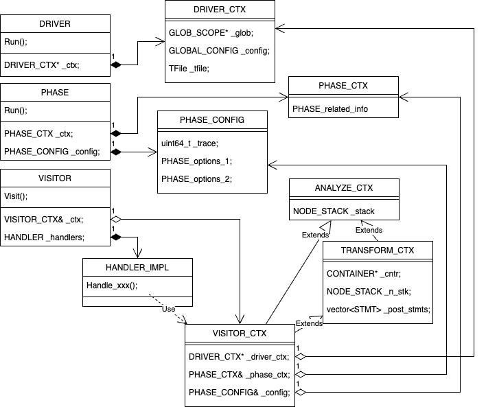

# IR Traverse Framework

**Important**: Markdown file (.md) is the master copy. PDF file (.pdf) is exported from markdown file only for review.

## Revision History

|Version|Author     |Date      |Description|
|-------|-----------|----------|-----------|
|0.2    ||2023.12.07|Update visitor, handler and context.|
|0.1    ||2023.08.24|Initial version.|

## Introduction
This document introduced how operator from different domains are organized and traversed.

## Background: Base, Core and Domain Core
Base defines the IR basic data structures for Scope (include global scope and function scope), Function (include code and local symbol table, etc). Global scope includes type, global variable, constant, etc. Base code is in this repo under "base" directory. 

AIR BASE component provides the following functionalities:
* Create global scope
* With global scope, create types:
   * Primitive types
   * Pointer types
   * Array types
   * Struct types
   * Function types
   * ...
* With global scope, create global variables
* With global scope, create constants
* With global scope, create functions:
   * Functions with definitions
   * Functions with declarations only
* With global scope, create function scope for function with definition
* With function scope, create local variables
* ...

AIR CORE component defines common operators. Core code is in this repo under "core" directory. Common operators includes:
* Function entry
* Block
* Control flow operators include:
   * if...then...else
   * for...loop
   * while...do
   * do...while
   * ...
* Direct load/store with symbols
* Indirect load/store with address expression
* Direct or indirect call
* Common arithmetic/logic operators include:
   * +,-,*,/,%
   * &,^,~
   * &&,||,!
   * ==, !=, >=, >, <=, <
   * ...

For other domains, DOMAIN CORE defines domain specific types and operators. For example, the DL domain may need Tensor type and NN operators like CONV/GEMM etc. Domain core code is in domain specific repo and also under the "core" directory.

## Problem
A lot of compiler passes rely on IR traversal. Unlike existing compiler infrastructures, AIR have distributed operator definitions that may cause problems in many areas because the structure of an IR node is determined by the operator which can be defined in different modules or repos. A single switch...case on AIR core operators won't be able to handle all operators.

We follow these assumptions:
* All domains include AIR core use the same base data structure.
* Base/Core doesn't know if there are extra domain specific extensions. Also there is no restrictions on how it's extended.
* Extended domain A knows all its dependencies include base/core and domains.
* Extended domain A doesn't know if there are other domains dependent on it.

## Simple Base and Core Code
Here we gave a simple base and core implementation for discussion on solutions to the problem.

Base component for basic data structure definition:
```c++
namespace base {
  // we assume a simple NODE structure to represent node in IR
  class NODE {
  public:
    uint32_t Domain() const;
    uint32_t Operator() const;
    int      Num_child() const;
    NODE*    Child(int index) const;
  };  // NODE
}   // base
```

Core component for common types and operators
```c++
// common type and operator definitions available for all domains
namespace core {
  enum { ID = 0; };  // core's domain ID is 0
  enum {             // core's operator
    FUNC_ENTRY,
    BLOCK,
    IF,
    FOR_LOOP,
    WHILE_DO,
    DO_WHILE
    ...
  };
}  // core
```

Domain A core for domain specific types and operators:
```c++
// extended type and operator definitions for specific domain
namespace DOMAIN_A {
  namespace core {
    enum { ID = 1; }; // domain A's ID is 1. Must not duplicate
    enum {            // domain A's operator
      OP_1,           // name/value may be the same
      OP_2,
      OP_3,
      ...
    }
  }  // core
}  // DOMAIN_A
```
Domain B core can also defines its own operators:
```c++
// extended type and operator definitions for specific domain
namespace DOMAIN_B {
  namespace core {
    enum { ID = 2; };  // domain B'a ID is 2. Must not duplicate
    enum {             // domain B's operator
      OP_1,            // name/value may be the same
      OP_2,
      ...
    }
  }  // core
}  // DOMAIN_B
```

## IR Traversal with Templatized Visitor
The solution uses two-level of templates to dispatch workload among domains and within the domain.

### Top-Level Visitor
Top-level visitor dispatch workload among domains according to IR node's domain ID.

```c++
// top-level dispatcher, which works on domain ID.
namespace base {
  // Each domain has 1 handle in the list
  template <typename CONTEXT, typename... HANDLERS>
  class VISITOR {
  public:
    // public interface to visit node
    void Visit(NODE* node) {
      Forward<0>(node->Domain(), node);
    }
  private:
    // try match domain ID to distribute workload
    template <uint32_t I>
    void Forward(uint32_t domain, NODE* node) {
      if (domain == std::get<I>(_handlers).ID) {
        // found the handler, distribute the workload
        std::get<I>(_handlers).Handle(this, node);
      } else if constexpr (I + 1 < sizeof...(HANDLERS)) {
        // check next handler
        Forward<I+1>(domain, node);
      } else {
        assert(false);  // wrong domain or no handler?
      }
    }
    // reference to CONTEXT
    CONTEXT& _context;

    // instances of all handlers
    std::tuple<HANDLERS...> _handlers;
  };
}
```

### Domain Internal Handler
Domain internal handler handles all operators defined in this domain. It checks the node operators and distribute workload to actual operator handler.
```c++
// second-level dispatcher, which is domain specific and works on operator.
namespace DOMAIN_A {
  namespace core {
    // Internal handler
    template <typename IMPL>
    class HANDLER {
    public:
      static constexpr uint32_t ID = DOMAIN_A::core::ID;

      template <typename VISITOR>
      void Handle_op_1(VISITOR* visitor, NODE* node) {
        _impl.Handle_op_1(visitor, node);
      }
      // ... other handle functions ...
      template <typename VISITOR>
      void Handle(VISITOR* visitor, NODE* node) {
        switch (node->Operator()) {
        case OP_1: Handle_op_1(visitor, node); break;
        case OP_2: Handle_op_2(visitor, node); break;
        // ... other operators in DOMAIN_A ...
        default: assert(false);
        }
      }
    private:
      IMPL& _impl;
    };  // HANDLER
  }  // core
}  // DOMAIN_A
```

### Handler Implementation
Handler implementation handles individual operators. If the operator has kids and its kids may involve operators from different domains, the visitor pointer should be used to traverse the kids so that the kids can be processed correctly.
```c++
// actual operator handler
namespace DOMAIN_A {
  namespace core {
    class HANDLER_IMPL {
    public:
      template <typename VISITOR>
      void Handle_op_1(VISITOR* visitor, NODE* node) {
        ......
        for (int i = 0; i < node->Kid_count(); ++i) {
          visitor->Visit(node->Kid(i));
        }
        ......
      }
    };  // HANDLER_IMPL
  }  // core
}  // DOMAIN_A
```

### Predefined Handler Implementations
There are 3 predefined handler implementations: NULL_HANDLER, INVALID_HANDLER, DEFAULT_HANDLER.

#### NULL_HANDLER
NULL_HANDLER does nothing in all of its Handle_<op>() methods. Just simply return to caller even without visiting its kids. NULL_HANDLER can be used for quick implementation of some analysis passes which only cares top level expression.

#### INVALID_HANDLER
INVALID_HANDLER asserts in all of its Handle_<op>() methods. INVALID_HANDLER can be inherited to catch potential errors caused by not handling any OPs.

#### DEFAILT_HANDLER
DEFAULT_HANDLER operates different for analysis phase and transform phase. For analysis phase, it visits all its kids recursively. For transform phase, it also visits all its kids recursively (usually the kids are cloned) and clone the node itself.

## VISITOR CONTEXT
Visitor context is designed to manage the context during the IR traversal. It also provides interface for handler implementation to access external information of driver, phase and so on. There are two basic types of context: ANALYZE_CTX and TRANSFORM_CTX.

### ANALYZE_CTX
ANALYZE_CTX is designed to maintain context for an analysis pass which only reads IR. ANALYZE_CTX maintains a stack of NODE for all parent NODEs of current NODE.

### TRANSFORM_CTX
TRANSFORM_CTX is designed to maintain context for an transformation pass which update or create new IR. TRANSFORM_CTX is inherited from ANALYZE_CTX. Besides the NODE stack of parent NODEs of current NODE, it also maintains a BLOCK stack for new NODEs and provide API to prepend or append STMT before and after current STMT being processed.

### USER CONTEXT
User context should inherit from either ANALYZE_CTX or TRANSFORM_CTX according to the functionality of the pass. User context can also keep reference to external objects so that the handler implementation can read or update those external objects during the IR traversal.



## Options and Trace
### Global Options
Global options are kept in DRIVER_CTX object. DRIVER holds the pointer to DRIVER_CTX and passed to user's VISITOR_CTX.

### Phase Options
Phase options are kept in <PHASE>_CONFIG object. <PHASE>_CONFIG is derived from COMMON_CONFIG. PHASE holds the instance of <PHASE>_CONFIG. The reference of <PHASE>_CONFIG is passed to user's VISITOR_CTX. In user context, use macro "DECLARE_<PHASE>_CONFIG_ACCESS_API" to append APIs to access <PHASE>_CONFIG.

### Trace
Trace object is kept in DRIVER_CTX. Handler implementation can get trace object from DRIVER_CTX and write trace information by trace API. In user context, use macro "DECLARE_TRACE_DETAIL_API" to append APIs to output detail tracing information. "DECLARE_TRACE_DETAIL_API" will append 3 tracing member functions into the user context class:
```c++
  // Trace args with C++ stream insertion operator
  template <typename... Args>
  void Trace(int32_t flag, Args&&... args);

  // Call f(os, args) to write to trace file
  template <typename F, typename... Args>
  void Trace_cmd(int32_t flag, F&& f, Args&&... args);

  // Call obj->Print(os) to write to trace file
  template <typename OBJ>
  void Trace_obj(int32_t flag, const OBJ& obj);
```

## Use cases
### IR Lowering
Both core and domain component should implement the lowering functionality for operators defined by core and the domain.
For core:
```c++
#include "air/core/handler.h"
// lower each operator defined in common core module
namespace core {
  class LOWER {
  public:
    template <typename VISITOR>
    void Handle_func_entry(VISITOR* visitor, NODE* node) {
      // lower func_entry
    }

    template <typename VISITOR>
    void Handle_block(VISITOR* visitor, NODE* node) {
      // lower block
    }

    ... other lowering functions ...
  };  // LOWER
}  // core
```

Same code should also be implemented in each domain. For the domain which want to implement a full functional lowering pass, it can assemble all lower component from core and all dependent domains.
```c++
#include "air/base/visitor.h"
#include "air/core/lowering.h"
#include "domain_a/core/lowering.h"
#include "domain_b/core/lowering.h"

namespace DOMAIN_B {
  namespace driver {
    // Context for IR lowering
    class LOWER_CTX : public air::base::TRANSFORM_CTX {
      // extra reference to external objects
    };

    // assemble visitor, handler and handler impl to a real visitor
    typedef air::base::VISITOR<
      air::core::LOWER_CTX,
      air::core::HANDLER<air::core::LOWER>,
      DOMAIN_A::core::HANDLER<DOMAIN_A>::core::LOWER>,
      DOMAIN_B::core::HANDLER<DOMAIN_B>::core::LOWER>>
    LOWER_VISITOR;

    class LOWER_PASS {
    public:
      void Run() {
        LOWER_CTX ctx;
        LOWER_VISITOR lower(ctx);
        // visit from function entry and lower all nodes
        lower.Visit(_func_scope->Func_entry());
      }
    };  // LOWER_PASS
  }  // driver
}  // DOMAIN_B
```

### Override Domain's Default Behavior
Domain may override its dependent core/domain default behavior by inheritance from core/domain's default handler implementation and override some or more handler implementations.
```c++
#include "domain_a/core/lowering.h"

namespace DOMAIN_B {
  namespace special {
    class SPECIAL_LOWER_A : public DOMAIN_A::core::LOWER {
    public:
      template <typename VISITOR>
      void Handle_func_entry(VISITOR* visitor, NODE* node) {
        // special lower func_entry for module B
      }

      template <typename VISITOR>
      void Handle_block(VISITOR* visitor, NODE* node) {
        // special lower block for module B
      }
      ... other lowering functions ...
    };  // SPECIAL_LOWER_A
  }  // special
}  // DOMAIN_B
```

Once the new handle implementation of module A is done in module B, the new handle implementation can be passed as the template parameter to module A's handler.
```c++
#include "air/base/visitor.h"
#include "air/core/lowering.h"
#include "domain_b/special/special_lower_a.h"
#include "domain_b/core/lowering.h"

namespace DOMAIN_B {
  namespace driver {
    // assemble visitor, handler and handler impl to a real visitor
    typedef air::base::VISITOR<
      air::core::HANDLER<air::core::LOWER>,
      DOMAIN_A::core::HANDLER<DOMAIN_B::special::SPECIAL_LOWER_A>,
      DOMAIN_B::core::HANDLER<DOMAIN_B::core::LOWER> >
    LOWER_VISITOR;

    class LOWER_PASS {
    public:
      void Run() {
        LOWER_VISITOR lower;
        // visit from function entry and lower all nodes
        lower.Visit(_func_scope->Func_entry());
      }
    };  // LOWER_PASS
  }  // driver
}  // DOMAIN_B
```

### IR b2a and b2c
IR b2a and b2c are similar. Both core and domain implement their own IR b2a and b2c for types and operators defined by core and domain. Then a full function IR b2a and b2c pass can be implemented on top of the VISITOR, HANDLER and HANDLER_IMPLs.

### IR verifier
IR verifier works in the same way. Both core and domain verify their own types and operators. Full function IR verifier pass is implemented on top of VISITOR, HANDLER and all HANDLER_IMPL verifiers for core and domains.

### IR simplifier
There are two possible implementation for IR simplifier. One is attribute based simplifier. Common attributes can be defined for all types/operators in different domains and Common simplifier works on these attributes. The other is similar to lowering, both core and domains implements their own simplifiers. In either way, the traversal framework proposed in this document is used to build this pass.
