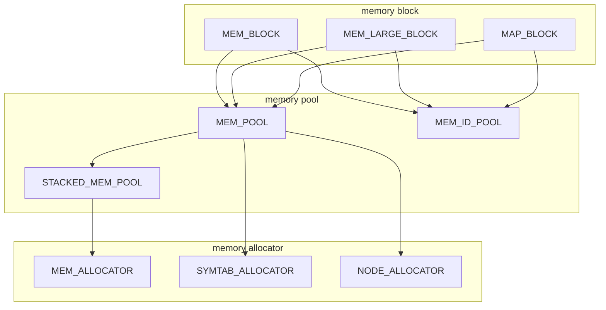

# Memory Pool and Allocator Design and Implementation

**Important**: Markdown file (.md) is the master copy. PDF file (.pdf) is exported from markdown file only for review.

## Revision History

|Version|Author     |Date      |Description|
|-------|-----------|----------|-----------|
|0.1    ||2023.07.31|Initial version.|

## Introduction

Memory pool and allocator is designed to manage memory and objects used by the compiler. Memory pool works similar to C malloc()/free() to allocate/deallocate memory. Memory allocator works similar to C++ new/new[]/delete/delete[] to create and destroy objects.

Raw memory are managed by memory block. We have 3 basic kinds of memory block.

* MEM_BLOCK

   A general memory block with fixed size. MEM_BLOCK is malloc-ed/freed from/to system as a whole by MEM_POOL, then the block can be split into small pieces to hold different data/objects.

* MEM_LARGE_BLOCK

   If the size of single data/object exceeds the general memory block size, a special large block is malloc-ed from system by MEM_POOL to hold the data/object.

* MMAP_BLOCK

   This is a special block associated with a file and created/destroyed by mmap()/munmap(). This block is **ONLY** used for IR file reader and writer. Do **NOT** use this kind of block for general data/object.

On top of raw memory block, MEM_POOL is introduced to manage memory blocks and provide interface to allocate/deallocate memory:

* MEM_POOL

   Basic memory pool for general memory management. MEM_POOL manages memory blocks represented by MEM_BLOCK/MEM_LARGE_BLOCK/MMAP_BLOCK and provides interface to allocate/deallocate memory.

* MEM_ID_POOL

   Enhanced memory pool which keeps underlying memory blocks in an array and memory objects can be accessed by index which is made up by memory block index and offset within the block.

* STACKED_MEM_POOL

   Enhanced memory pool with push()/pop() mechanism that keeps a mark when push() is called and free all memory block allocated after the mark when pop() is called. This is useful for general global/local memory pool.

On top of memory pool, different memory allocators are introduced to provide strong typed object creation/deletion. memory allocators also provide interoperability with C++ STL allocator.

* MEM_ALLOCATOR

  Built on top of STACKED_MEM_POOL to provide strong typed object creation and deletion with variable size. When the object is freed, the memory won't be revoked until the memory pool is pop-ed or totally destroyed.

* SYMTAB_ALLOCATOR

  Built on top of MEM_POOL to provide memory allocator for symbol table entries. Usually the size of entry in one table is fixed. When an entry is freed, the memory can be revoked and allocated for a new entry later.

* NODE_ALLOCATOR

  Builton top of MEM_POOL to provide memory allocator for nodes in IR. Usually the size of nodes may be different but the sizes of most of the nodes are a narrow range. NODE_ALLOCATOR may maintain a few free node list to reuse nodes with different size.

Memory pool creates memory block when there is no enough memory in the pool. Each memory block can only be accessed and managed by 1 memory pool. Memory pool can be shared by multiple memory allocators. All objects allocated by these allocators co-exists in the same memory pool.



To help debug and measure memory bugs and performance, we introduce a memory pool manager to track the life cycle of each memory pool and measure memory consumption of each pool.

* MEM_POOL_MANAGER

   Manages all memory pools' life cycle and memory consumption.

Memory manager is used for debugging purpose and help triage memory consumption issue.

## Common Data Structures

This section discusses common data structures used in memory pool.

### TAGGED_POINTER
Tagged pointer uses low 3 bits of pointer value to record some extra info about the pointer.
```c++
// save tag in low 3 bits of pointer value
class TAGGED_POINTER {
    // mask for tag and pointer
    enum { TAG_MASK = 0x7, PTR_MASK = ~0x7 };
public:
    template<typename T, typename TAG>
    TAGGED_POINTER(T* ptr, TAG tag) : _tagged_pointer(ptr | tag) {
        assert ((tag & PTR_MASK ) == 0);
        assert ((ptr & TAG_MASK ) == 0);
    }
    // get tag from tagged pointer
    template<typename TAG>
    TAG Tag() const { return _tagged_pointer & TAG_MASK; }
    // get real pointer from tagged pointer
    template<typename T>
    T*  Ptr() const { return _tagged_pointer & PTR_MASK; }
    // overload operator->() so that this can be used as a pointer
    template<typename T>
    T*  operator->() const { return Ptr<T>(); }
    // overload operator*() so that this can be used as a pointer
    template<typename T>
    T&  operator*() const { return *Ptr<T>(); }

private:
    // raw value for pointer and tag
    uintptr_t _tagged_pointer;
};
```

## Memory Block Interface

This section discusses the interface of memory block.
```c++
// block kind tag
enum class MB_KIND_TAG {
  MBK_ERROR = 0,    // to catch error only
  MBK_NORMAL = 1,   // normal memory block
  MBK_LARGE = 2,    // large block
  MBK_MMAP = 3,     // mmap() block
};

// block head to record block meta information
struct BLOCK_HEAD {
    // available bytes in this block
    uint32_t _avail;
    // magic number for debug purpose
    uint32_t _magic;
    // tagged pointer for next block
    TAGGED_POINTER _next;
};

// large block head to record large block meta information
struct LARGE_BLOCK_HEAD {
    // available bytes in this block
    size_t _size;
    // tagged pointer for next block
    TAGGED_POINTER _next;
};

// block entry for MMAP block
struct MMAP_BLOCK_ENTRY {
    // address from mmap()
    void *_pmap;
    // tagged pointer for next block
    TAGGED_POINTER _next;
};
```
### MEM_BLOCK
```c++
// MEM_BLOCK with fixed BLOCK_SIZE. Total available size is BLOCK_SIZE - sizeof(BLOCK_HEAD).
template<int BLOCK_SIZE>
class MEM_BLOCK {
    // magic number for debug purpose
    enum { MB_MAGIC = 0xBEEF };
public:
    // return available bytes in this block
    uint32_t Available() const { return _head._avail; }

    // allocate n bytes from block. if not available, return nullptr.
    char*    Allocate(uint32_t n) {
        if (n > _avail) {
            return nullptr;
        }
        char* buf = (char*)this - _avail;
        _avail -= n;
        return buf;
    }

    // static method to create a normal block
    static MEM_BLOCK<BLOCK_SIZE>* Create() {
        char* buf = air_malloc(BLOCK_SIZE);
        return new(buf) MEM_BLOCK();
    }

    // static method to destroy a normal block
    static void Destroy(MEM_BLOCK<BLOCK_SIZE>* blk) {
        assert(blk->_head._magic == MB_MAGIC);
        air_free(blk);
    }

    MEM_BLOCK(const MEM_BLOCK&) = delete;
    MEM_BLOCK& operator=(const MEM_BLOCK&) = delete;
    ~MEM_BLOCK() = delete;

private:
    // private constructor
    MEM_BLOCK() {
        // initialize available bytes
        _head._avail = BLOCK_SIZE - sizeof(BLOCK_HEAD);
        // set magic number
        _head._magic = MB_MAGIC;
        // set next is nullptr
        _head._next = TAGGED_POINTER(nullptr, MBK_ERROR);
    }

    // head to manage this block
    BLOCK_HEAD _head;
    // data buffer
    char       _data[BLOCK_SIZE - sizeof(BLOCK_HEAD)];
};
```

### MEM_LARGE_BLOCK
```c++
// MEM_BLOCK with fixed BLOCK_SIZE. Total available size is BLOCK_SIZE - sizeof(BLOCK_HEAD).
class MEM_LARGE_BLOCK {
public:
    // constructor
    MEM_LARGE_BLOCK(size_t sz) {
        _head._size = sz;
        _head._next = TAGGED_POINTER(nullptr, MBK_ERROR);
    };

    // return address of the large block
    char* Address() const {
        return (char*)this + sizeof(LARGE_BLOCK_HEAD);
    }

    // static method to create a large memory block
    static MEM_LARGE_BLOCK* Create(size_t sz) {
        char* buf = air_malloc(sz + sizeof(LARGE_BLOCK_HEAD));
        return new(buf) MEM_LARGE_BLOCK(sz);
    }

    // static method to create a large memory block
    static void Destroy(MEM_LARGE_BLOCK *blk) {
        air_free(blk);
    }

    MEM_LARGE_BLOCK(const MEM_LARGE_BLOCK&) = delete;
    MEM_LARGE_BLOCK& operator=(const MEM_LARGE_BLOCK&) = delete;
    ~MEM_LARGE_BLOCK() = delete;

private:
    // meta info for this large block
    LARGE_BLOCK_HEAD _head;
};
```

### MMAP_BLOCK
```c++
// memory block created/destroyed by mmap()/munmap()
class MMAP_BLOCK {
    // TODO: mmap() block
};
```

## Memory Pool Interface
This section discusses the interface of memory pool.

### MEM_POOL
```c++
// general memory pool
template<BLOCK_SIZE>
class MEM_POOL {
public:
    // allocate memory with n bytes
    char *Allocate(size_t n);
    // deallocate memory, usually do nothing
    void  Deallocate(char *p, size_t n = 0);

private:
    // current memory block
    TAGGED_POINTER _block;
};
```

### MEM_ID_POOL
```c++
// pair of memory object with raw address and Id
class MEM_ID {
  // raw address
  char* _addr;
  // Id
  uint32_t _id;
};

// memory pool which can be accessed by Id
template<BLOCK_SIZE, ALIGN_SIZE>
class MEM_ID_POOL {
public:
  // allocate memory with n bytes
  MEM_ID Allocate(size_t n);
  // Get raw address from Id
  char* Id_to_addr(uint32_t id);
};
```

### STACKED_MEM_POOL
```c++
// stacked memory pool with a marker stack to manage blocks.
class STACKED_MEM_POOL : public MEM_POOL {
public:
    // create a new marker on current memory block and push to _marker stack
    MARKER *Push();

    // pop from _marker stack and free all memory blocks allocated between two markers
    void    Pop(const MARKER *);

private:
    // marker for a new frame for push/pop
    struct MARKER {
        // tagged pointer to current block which contains the marker
        TAGGED_POINTER _block;
        // pointer to previous marker
        MARKER        *_prev;
    };

    // pointer to top of marker stack
    MARKER *_marker;
};
```

## Memory Allocator Interface

### MEM_ALLOCATOR
```c++
// strong typed memory allocator, which will also call constructor
class MEM_ALLCATOR {
public:
    // construct memory allocator on top of memory pool
    MEM_ALLCATOR(MEM_POOL *);
    // allocate a object with given type T. also calls constructor
    template<typename T, typename... Args>
    T* Allocate(Args&&... args);
    // allocate n objects with given type T. also calls constructor
    template<typename T, typename... Args>
    T** Allocate_array(size_t n, Args&&... args);
};

// wrapper for c++ stl allocator
template<typename T>
class CXX_MEM_ALLOCATOR {
public:
    // constructor
    CXX_MEM_ALLOCATOR(MEM_POOL *);
    // allocate memory
    T* allocate();
    // deallocate memory
    void deallocate(T *p, size_t n);
};
```
### NODE_ALLOCATOR
```c++
// allocator for IR nodes. assume nodes have different size due to their kids count is different
template<typename T>
class NODE_ALLOCATOR {
public:
    // constructor
    NODE_ALLOCATOR(MEM_POOL *);
    // allocate an IR nodes with n_kid of kids
    template<typename T>
    T* Allocate(int n_kid);
    // deallocate IR nodes and put back to free list
    template<typename T>
    void Deallocate(T*);

private:
    // memory pool manages underlying memory blocks
    MEM_POOL *_mpool;
    // array of free nodes with [0, NUM_OF_FREE_CHAIN) kids
    FREE_ENTRY *_free_entry[NUM_OF_FREE_CHAIN];
};
```
### SYMTAB_ALLOCATOR
```c++
// allocator for symtab entries. assume all entries with type T have the same size
template<typename T>
class SYMTAB_ALLOCATOR {
public:
    // constructor
    SYMTAB_ALLOCATOR(MEM_POOL *);
    // allocate a symtab entry
    T* Allocate();
    // deallocate a symtan entry
    void Deallocate(T*);

private:
    // memory pool manages underlying memory blocks
    MEM_POOL *_mpool;
    // head of free symtab entries.
    FREE_ENTRY *_free_entry;
};
```

## Memory Manager Interface
This section discusses the interface of memory manager to help triage bugs and memory consumption.

### MEM_POOL_MANAGER
```c++
// memory pool manager
class MEM_POOL_MANAGER {
public:
    // register a memory pool when it's created
    void Reg_mem_pool(const MEM_POOL *mp);
    // unregister a memory pool when it's destroyed
    void Unreg_mem_pool(const MEM_POOL *mp);
    // push a mark so that delta since last mark can be reported
    void Push();
    // pop a mark
    void Pop();
    // report memory consumption delta since last push
    void Report_delta();
    // report all memory consumption
    void Report();
};
```

## Examples
This section describes an example to use different memory pool and allocator.
```c++
class A {
public:
    A(const char*, int);
};
int foo(const char* str) {
    MEM_POOL mp; // local pool
    MEM_ALLOCATOR ma(&mp);  // allocator
    char* ptr = mp.Allocate(strlen(str) + 8);
    memcpy(ptr, str);
    memcat(ptr, ".copy");
    A *a = ma.Allocate<A>(ptr, 0);
    return 0;
    // ma and mp are automatically destroyed.
    // ptr and a points to invalid memory and shouldn't be reused
}
A* bar(MEM_POOL *mp) {
    MEM_ALLOCATOR ma(mp);  // allocator
    A *a = ma->Allocate<A>("str", 1);
    return a;
    // a was created on mp, which is still valid
}
A* jar(STACKED_MEM_POOL *mp) {
    MEM_ALLOCATOR ma(mp);  // allocator
    A *a = ma->Allocate<A>("str", 2);
    mp->Push();
    A *b = ma->Allocate<A>("str", 3);
    mp->Pop();
    // memory allocated between Push() and Pop() are deallocated.
    // b points to invalid memory and shouldn't be reused.
    return a;
    // a was created before Push() so it's still valid.
}
```
This example shows how memory are recycled by NODE_ALLOCATOR and SYMTAB_ALLOCATOR.
```c++
class IR_NODE {
    // ......
};
int foo() {
    MEM_POOL mp;
    NODE_ALLOCATOR na(&mp);
    IR_NODE* n0 = na->Allocate(0);  // n_kid = 0
    IR_NODE* n1 = na->Allocate(1);  // n_kid = 1
    IR_NODE* n2 = na->Allocate(2);  // n_kid = 2
    na->Deallocate(n1);  // put address of n1 to free list with nkid=1
    IR_NODE* n3 = na->Allocate(1);  // n1 should be returned
    na->Deallocate(n0);  // put address of n0 to free list with nkid=0
    na->Deallocate(n2);  // put address of n2 to free list with nkid=2
    IR_NODE* n4 = na->Allocate(1);  // a new pointer should be returned
}
```
