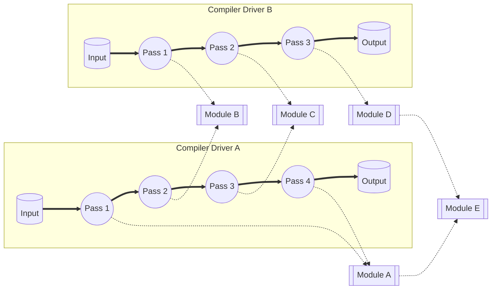
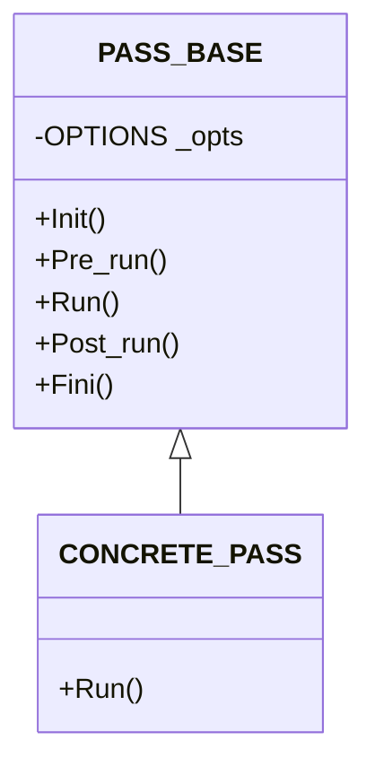
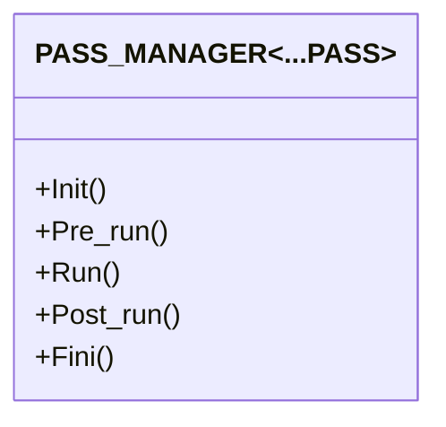
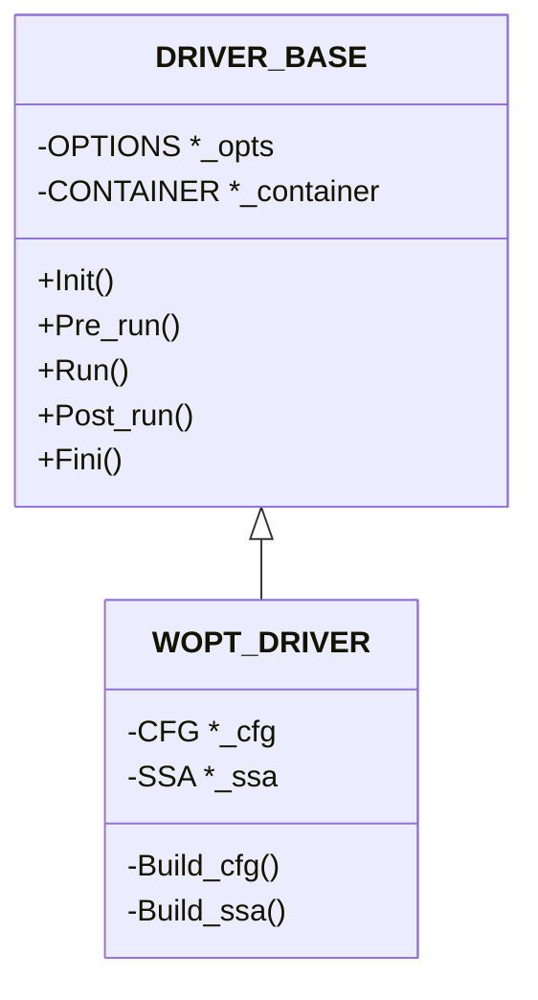
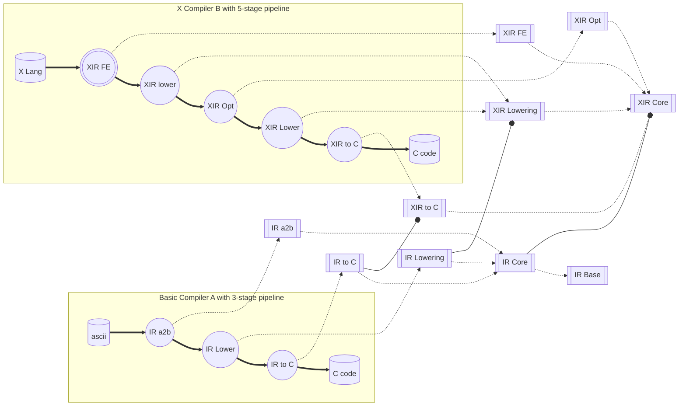

# AIR Pass Manager Design and Implementation

**Important**: Markdown file (.md) is the master copy. PDF file (.pdf) is exported from markdown file only for review.

## Revision History

|Version|Author     |Date      |Description|
|-------|-----------|----------|-----------|
|0.1    ||2023.07.31|Initial version.|


## Introduction

Pass, Pass Manager and Driver are the way that AIR Compiler Infrastructure organizes the whole compilation pipeline. AIR Pass and Pass Manager is **NOT** aiming to provide the flexibility to run the compilation pipeline in arbitrary phase ordering. **Instead**, AIR Pass and Pass Manager provides abilities to developers to organize their compilation pipeline to construct compilers.

AIR Pass and Pass Manager assumes the developer knows the design principle of phase ordering, dependencies between passes and the proper insertion point of the new pass in developing. AIR Pass does **NOT** provide interface to describe the preconditions and side-effects of the pass to assemble the pipeline automatically based on the dependencies of passes. AIR Pass Manager works with a fixed pipeline specified by developers. AIR Pass Manager provides facilities to assemble passes, control pass behavior according to the options, trace and validate input and output, measure CPU and memory usage of the pass, and so on.

AIR Pass Manager is designed for multiple compiler constructions with statically-assembled pipeline. With this design, Modules (Components) are basic building blocks, wrapped by Pass, then assembled by Pass Manager to construct the compilation pipeline. Driver is designed to host the compilation pipeline and all related data structures shared among the passes in the pipeline.




## AIR Pass
AIR Pass is designed to wrap modules to perform analysis or transformations on AIR, then assembled by Pass Manager to construct the compilation pipeline.

AIR pass runs on different scope from a sub-range of a function to whole program. 



## AIR Pass Manager
AIR Pass Manager is designed to assemble passes to construct a pipeline to process the IR. The pipeline assembled by Pass Manager can be used to construct the compiler, or as a pass of another pipeline. Each pass's Init(), Pre_run() and Run() methods will be invoked in the same order as they were added to the template arguments. Post_run() and Fini() methods will be invoked in reverse order.



A new wrapper class PIPELINE_TO_PASS is introduced to convert a pipeline organized by PASS_MANAGER into a Pass which can be assembled by another Pass Manager.

## AIR Driver
AIR Driver is designed to contain the compilation pipeline and related data structures shared among the passes in the pipeline. The driver can be instantiated and invoke by main() as the top level driver of the compiler, or can also be wrapped by class DRIVER_TO_PASS to be assembled by upper level Pass Manager. The difference between PIPELINE_TO_PASS and DRIVER_TO_PASS is passes in PIPELINE_TO_PASS doesn't have their own shared data structures. For example:



## Memory pool usage convension
For memory pool used internally by a module, the pool instance is owned by the module. If memory pool shared by a few modules inside the same pass, the pool instance should be placed in the pass. For information produced/consumed among several modules or passes, a standalone information manager should be introduced (for example, alias manager, du manager, etc). This information manager owns the memory pool to save information. The manager instance is owned by the common ancester Pass, Pass manager or Driver of these passes or modules.

## Option handling
There is only 1 option handler instance to parse command line options and handle environment variables. This single instance is placed in top level Driver and can be used by all nested passes, pipelines and sub-drivers.

## Error handling, Tracing, IR b2a and IR b2c
There is 1 output device instance for error handling, tracing, IR b2a, IR b2c respectively. These output instances are also placed in top level Driver. So that they can interact with Option handler to control their behavior according to the options. These instances can also be used by all nested passes, pipelines and sub-drivers.

## Pass and Pass Manager Example
In this example, we assume a compiler with 3 stages: source to IR, IR lowering, IR to source. 

### Modules
So we have the following modules:
* IR repository

   Provide interface to manipulate IR, include creating symbols/types/IR nodes, retrieve Symbol/Type/IR node according to their indices.
   ```c++
   class CONTAINER {
   public:
       SYMPTR  New_symbol(...);
       TYPEPTR New_type(...);
       NODEPTR New_node(...);
   };
   ```
* Source File Parser

   Parse input source file to contruct in-memory Abstract Syntax Tree (AST).
   ```c++
   class LANG_PARSER {
   public:
       void Parse();
   };
   ```
* AST to IR translator

   Traverse AST and translate AST nodes into IR. This module invoke CONTAINER interfaces to create IR.
   ```c++
   class AST_TO_IR {
   public:
       void Convert();
   };
   ```
* IR Lowering

   Traverse IR and lower IR structures and operations. This module invoke CONTAINER interfaces to traverse IR nodes and lower to next level.
   ```c++
   class IR_LOWERING {
   public:
       void Lower();
   };
   ```


* IR to source

   Traverse IR and generate source from IR. This module invoke CONTAINER interfaces to traverse IR nodes and generates source from nodes.
   ```c++
   class IR_TO_SRC {
   public:
       void IR_to_src();
   }
   ```

### Passes
On top of these modules, we may have passes to wrap the modules. In this example, we implement 4 passes to invoke parser, AST to IR, IR lowering and IR to source respectively.

* Parse Pass

   This pass is built on top of LANG_PARSER module, which parse input source file into Abstract Syntax Tree (AST).
   ```c++
   class LANG_PARSE_PASS : public PASS_BASE {
   public:
       void Init() { _parser.Init(); }
       void Fini() { _parser.Fini(); }
       void Run()  { _parser.Parse(); }
   private:
       LANG_PARSER _parser;
   };
   ```

* AST to IR Pass

   This pass is built on top of AST_TO_IR module, which traverse AST to generate IR.
   ```c++
   class AST_TO_IR_PASS : public PASS_BASE {
   public:
       void Init() { _ast_to_ir.Init(); }
       void Fini() { _ast_to_ir.Fini(); }
       void Run()  { _ast_to_ir.Convert(); }
   private:
       AST_TO_IR _ast_to_ir;       
   };
   ```

* IR Lowering Pass

   This pass is built on top of IR_LOWERING module, which traverse IR and lower nodes to next level.
   ```c++
   class IR_LOWERING_PASS : public PASS_BASE {
   public:
       void Init() { _ir_lowering.Init(); }
       void Fini() { _ir_lowering.Fini(); }
       void Run()  { _ir_lowering.Lower(); }
   private:
       IR_LOWERING _ir_lowering;       
   };
   ```

* IR to source pass

   This pass is built on top of IR_TO_SRC module, which traverse IR and generate source code from nodes.
   ```c++
   class IR_TO_SRC_PASS : public PASS_BASE {
   public:
       void Init() { _ir_to_src.Init(); }
       void Fini() { _ir_to_src.Fini(); }
       void Run()  { _ir_to_src.IR_to_src(); }
   private:
       IR_TO_SRC _ir_to_src;   
   };
   ```

### Pass Manager
In this example, we demonstrate two different approaches to organize the compilation pipeline. 4-stage straightline pipeline (Parse - AST to IR - Lower - IR to source) and 3-stage pipeline (Frontend - Lower - IR to source) with first stage made up by a 2-stage pipeline (Parse - AST to IR).

* 4-stage pipeline

   Set up a straightline 4-stage pipeline with PASS_MANAGER to invoke 4 passes above directly.
   ```c++
   typedef PASS_MANAGER<LANG_PARSER_PASS,
                        AST_TO_IR_PASS,
                        IR_LOWERING_PASS,
                        IR_TO_SRC_PASS> MAIN_PIPELINE;
   ```
* 3-stage pipeline with first stage made-up by a 2-stage pipeline
   
   Set up a straight line 2-stage pipeline with PASS_MANAGER as FRONT_END_PASS, then set up a straight line 3-stage pipeline as MAIN_PIPELINE.
   ```c++
   typedef PASS_MANAGER<LANG_PARSER_PASS,
                        AST_TO_IR_PASS> FRONT_END_PIPELINE;
   class FRONT_END_DRIVER : public DRIVER_BASE {
   public:
      FRONT_END_PIPELINE _pipeline;
      AST_TO_SYM_MAP     _sym_map;
      AST_TO_TY_MAP      _ty_map;
   };
   typedef PASS_MANAGER<DRIVER_TO_PASS<FRONT_END_DRIVER>,
                        IR_LOWERING_PASS,
                        IR_TO_SRC_PASS> MAIN_PIPELINE;
   ```

### Main Driver
Once the main pipeline is set up, it can be integrated into DRIVER to drive the whole compilation process. 
```c++
// Driver class interface
class DRIVER {
public:
    DRIVER(int argc, char* argv);
    // initialize the compiler
    void Init();
    // run main compilation pipeline
    void Run();
    // finalize the compiler
    void Fini();
private:
    OPTIONS       _opts;  // parse command line options
    MAIN_PIPELINE _main;  // compilation pipeline
};

// Driver class implementation
void DRIVER::Init() {
    // Parse options
    _opts.Init();
    // Init pass manager and all passes in the pipeline
    _main.Init();
}

void DRIVER::Run() {
    // run main pipeline
    _main.Run();
}

void DRIVER::Fini() {
    // finalize main pipeline
    _main.Fini();
    // finalize options
    _opts.Fini();
}

// Finally we can define main()
int main(int argc, char* argv[]) {
    DRIVER driver(argc, argv);
    driver.Init();
    driver.Pre_run();
    driver.Run();
    driver.Post_run();
    driver.Fini();
    return 0;
}
```

## A Complex Example
Consider a more complex scenario. We have a basic compiler infrastructure with the following modules:

* IR Base. Defines IR data structures.
* IR Core. Defines core types and operators.
* IR Lowering. Lower high level types and operators to low level.
* IR a2b. Generate IR binary form from ascii form.
* IR to C. Generate C code from IR.

Based on these modules, we can assemble a simple compiler with 3 stages include IR a2b, IR Lowering and IR to C.

An enhanced compiler with extended IR (XIR) definitions, front end, multiple optimization and lowering phases and IR to C modules:

* XIR Core. Defines extended types and operators.
* XIR Lowering. Lower high level types and operators to low level.
* XIR Opt. Optimization on XIR.
* XIR Frontend (FE). Front end parse XIR Lang and generate XIR.
* XIR to C. Generate C code from XIR.

Base modules are re-used by class composition. XIR Core references IR Core to operate core types and operators, as well as XIR Lowering and XIR to C. Based on XIR modules, we can assemble a extended compiler with 5 stages include XIR FE, XIR Lowering, XIR Optimization, XIR Lowering, XIR to C.





## Files
|File |Location |Notes |
|-----|---------|------|
|PassManager.md |air-infra/docs |This document |
|pass.h |air-infra/include/air/driver |Pass header file, #include "air/driver/pass.h" |
|pass_mgr.h |air-infra/include/air/driver |Pass Manager header file, #include "air/driver/pass_mgr.h" |
|driver.h |air-infra/include/air/driver |Driver header file, #include "air/driver/driver.h" |
|pass.cxx |air-infra/driver/src |Pass source file |
|pass_mgr.cxx |air-infra/driver/src ｜Pass Manager source file |
|driver.cxx |air-infra/driver/src ｜Driver source file |
|pass.cxx |air-infra/driver/unittest |Google test based unit test |
|pass_mgr.cxx |air-infra/driver/unittest |Google test based unit test |
|driver.cxx |air-infra/driver/unittest |Google test based unit test |
